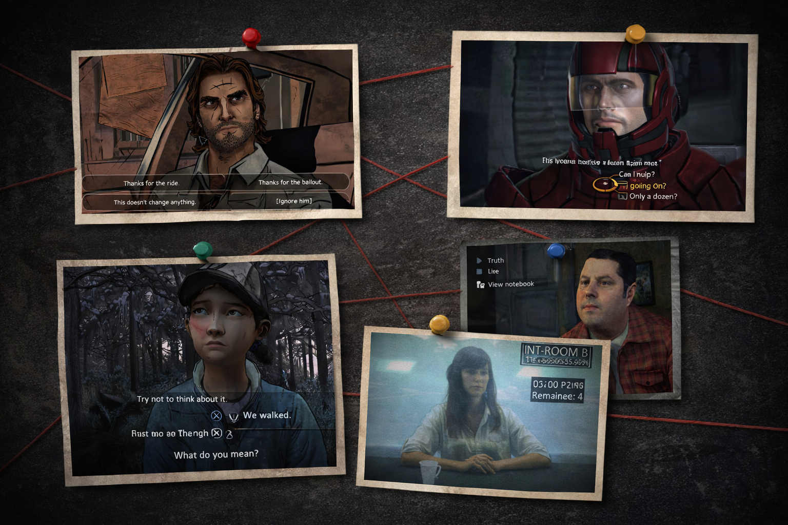
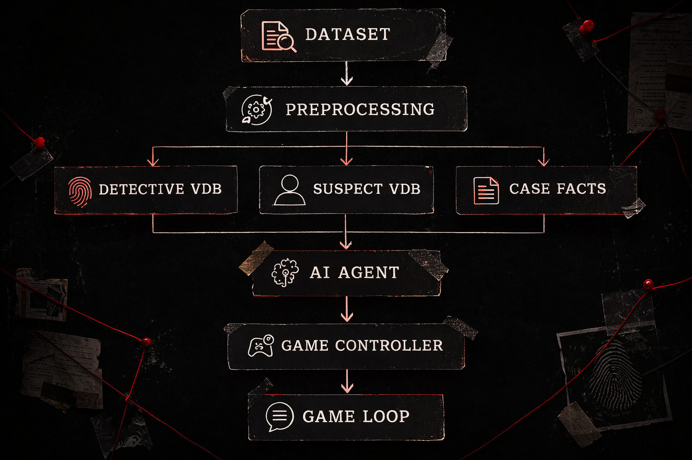
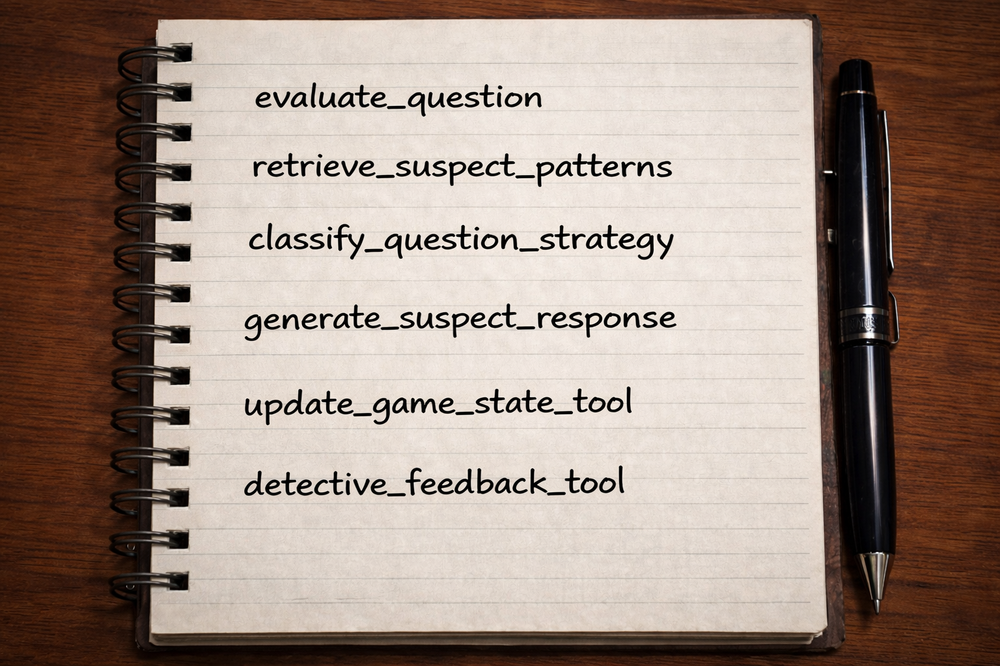
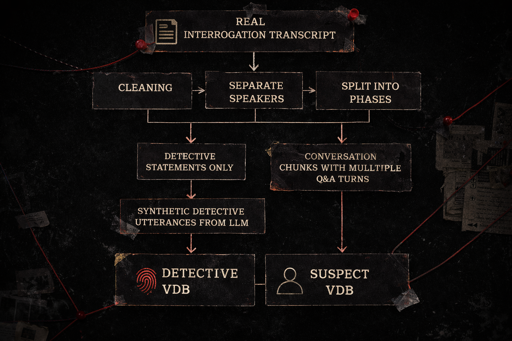

# AI Interrogation Game — Semantic Gameplay Prototype

An experimental AI-driven interrogation game where the player questions a suspect using natural language.

The system combines **LLMs, embeddings, vector search and game state mechanics** to interpret the player's questions and generate context-aware suspect responses.

Instead of selecting dialogue options, the player interacts with the game through **free-form language**, and the system reacts to the **meaning of the player's questions**.

---

# Context

Ever since large language models — and especially ChatGPT — became widely accessible, I’ve been wondering how they might transform **video game design**.

Not just as tools for generating content, but as systems that could enable **entirely new mechanics**.

The first area that came to mind was **narrative and dialogue**. Video game storytelling can be incredible, but when it comes to moment-to-moment dialogue, we’ve historically relied on fairly **deterministic systems**: dialogue trees, branching paths, predefined responses. They can be deep and complex, but they’re still fundamentally scripted.

In most games, mechanics require very controlled inputs to work properly: dialogue options, keywords, predefined actions. Language, by contrast, is messy, ambiguous and open-ended, which is why it has rarely been used directly as a gameplay input.

Additionally, traditional dialogue systems inevitably limit the player's **self-expression**.

But large language models make something new possible: designing mechanics that are carefully structured, while allowing the player to interact with them through **free language instead of predefined options**.

This could open the door to mechanics built around **investigation, persuasion, negotiation, deduction or logical reasoning**, where the player expresses their intent in their own words.

This project explores that idea through a prototype interrogation system where:

- the player acts as a detective  
- an AI agent plays the suspect  
- the system evaluates the **meaning and strategy** of the player's questions  
- and the suspect dynamically reacts based on interrogation psychology  

In practice, the key enabling technology behind this shift is **embeddings**, which allow the system to measure semantic relationships between player questions and interrogation strategies.

If you're new to embeddings, this visual explanation by 3Blue1Brown is an excellent introduction:

https://www.youtube.com/watch?v=wjZofJX0v4M

---

# The Case Behind the Prototype

The prototype is inspired by the real interrogation of **Stephanie Lazarus**, a former LAPD officer convicted for the murder of **Sherri Rasmussen**.

This interrogation became widely discussed online due to the fascinating psychological dynamics between the detective and Lazarus.

The full interrogation can be found here:

https://www.youtube.com/watch?v=t5ljpPTNvCM

In the prototype, the player takes the role of the detective interrogating Stephanie.

---

# Game Goal

The objective of the game is to extract useful information from the suspect without causing the interrogation to collapse.

The player must:

- build rapport
- gather information
- introduce evidence
- force contradictions

The system tracks two main variables:

**Progress**

Represents how much useful information the detective has extracted.

**Pressure**

Represents how defensive the suspect has become.

Too much pressure and the interrogation fails.

Fill the Progress meter without filling the Pressure meter

---

# Key Design Ideas

### Language as Gameplay Input

The player interacts using **free-form natural language** instead of selecting dialogue options.

The system interprets meaning and strategy from the player's questions.

---

### Embeddings as Semantic Sensors

Embeddings represent questions and dialogue as vectors in semantic space.

This allows the game to measure:

- similarity to interrogation strategies
- relevance to case topics
- conversational progression

---

### Interrogation Pacing

The interrogation is divided into phases:

- rapport building
- information gathering
- confrontation

This allows the system to evaluate whether a question is appropriate for the current moment.

---

### Strategy Detection

The system uses GPT-4o to classify the player's questioning strategy:

- rapport
- neutral inquiry
- confrontation
- accusation

Different strategies affect the suspect’s behavior.

---

# System Architecture

The system is built as an **AI-driven interrogation loop** combining:

- Game Controller
- LangChain agent tools
- Vector retrieval (RAG)
- LLM reasoning

Runtime flow:

1. Player asks a question
2. Question is embedded
3. Similar interrogation patterns are retrieved
4. Question strategy is classified
5. Game state is evaluated
6. GPT-4o generates a response
7. Game state is updated

---

# Game Controller

The interrogation is managed by a **GameController** that tracks the internal game state.

Main variables:

- interrogation phase
- pressure level
- progress score

The controller determines how each player question affects the suspect.

---

# Agent Tools

The agent uses several tools:

**evaluate_question**

Compares the player's question with the detective vector database.

Produces:

- semantic similarity score
- phase alignment score

---

**retrieve_suspect_patterns**

Retrieves dialogue examples from the suspect vector database.

Helps the LLM reproduce the suspect's speaking style.

---

**classify_question_strategy**

Uses GPT-4o to classify interrogation strategy and tone.

---

**generate_suspect_response**

Generates the suspect's reply using:

- chat history
- case facts
- retrieved dialogue
- interrogation phase
- pressure level
- strategy classification

---

**update_game_state**

Updates:

- progress
- pressure
- phase

Progress full → game won
Pressure full → interrogation fails

---

# Dataset & Preprocessing

The dataset is built from the full interrogation transcript of the Lazarus case.

The preprocessing pipeline performs:

1. transcript cleaning  
2. speaker separation  
3. phase segmentation  
4. dialogue chunking  
5. detective question extraction  
6. synthetic question generation using GPT-4o  

Synthetic questions help create a **denser embedding space for interrogation strategies**.

---

# Embeddings & Vector Search

The system uses **OpenAI embeddings** to represent dialogue and questions.

These embeddings are stored in **Pinecone vector databases**.

Two main indexes are used:

**Detective VDB**

Contains interrogation questions from the detective plus synthetic variations.

Used to evaluate the player's questioning strategy.

**Suspect VDB**

Contains dialogue chunks from the suspect.

Used to retrieve behavioral examples for the LLM.

---

# Notebooks

**preprocessing_pipeline.ipynb**

Creates the dataset and builds the vector databases.

**interrogation_agent_runtime.ipynb**

Implements the AI interrogation system and game controller.

**evaluation.ipynb**

Tests similarity, retrieval behavior and system responses.

---

# Tech Stack

- Python  
- LangChain  
- GPT-4o  
- OpenAI Embeddings  
- Pinecone Vector Database  
- Jupyter Notebooks  

---

# Future Improvements

Possible extensions include:

- game engine integration
- contradiction detection mechanics  
- evidence confrontation systems  
- multi-suspect investigations  
- visual semantic maps of conversations  

---

# Final Thoughts

This project explores how **language itself could become a gameplay interface**.

Embeddings allow the system to interpret meaning rather than keywords, opening the possibility for new kinds of interactive mechanics.

The prototype should be understood as an exploration of design possibilities rather than a finished game system.
